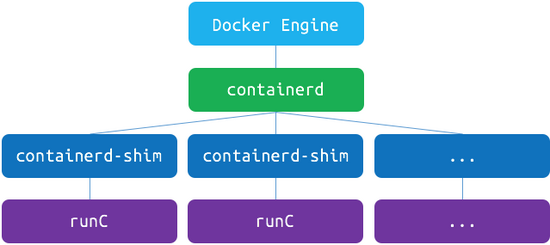

# Docker相关问题

- dockerd通过gRPC和containerd通信
- 如果是start或者exec容器，containerd就拉起一个container-shim
- container-shim拉起之后，拉起runC进程，runC

- [runC](https://github.com/opencontainers/runc): CLI tool for spawning and running containers according to the OCI specification
- [containerd](https://github.com/containerd/containerd): An open and reliable container runtime
