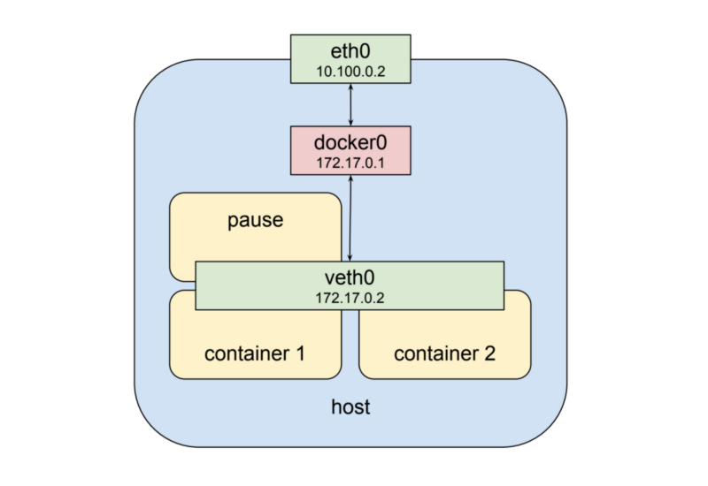
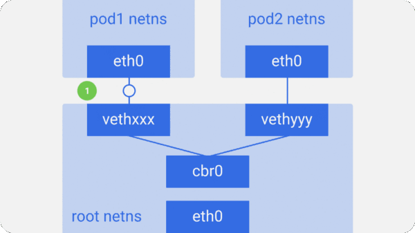
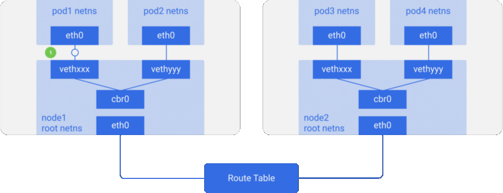

# Kubernetes相关问题

- pause容器负责拿住网络，其他容器使用加入pause的network namespace
- 创建一套veth pair，一头插在pause上，一头插在docker0上。docker0虽然是网桥，
但是有IP，相当于路由器。docker0连在eth0上。

-----------------

- https://medium.com/@ApsOps/an-illustrated-guide-to-kubernetes-networking-part-1-d1ede3322727
- https://medium.com/google-cloud/understanding-kubernetes-networking-pods-7117dd28727
- https://tonybai.com/2017/01/17/understanding-flannel-network-for-kubernetes/
