# TCP/IP协议

ref: https://jiajunhuang.com/articles/2017_08_12-tcp_ip.md.html

ref: https://jiajunhuang.com/articles/2017_09_02-tcp_ip_part2.md.html

- TCP/IP四层协议图

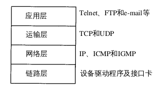

- 不同协议对应在四层中

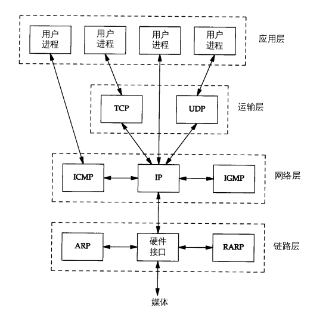

- IP地址分类

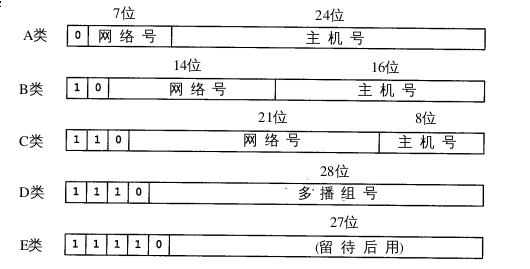

- TCP/IP概览

- IP首部

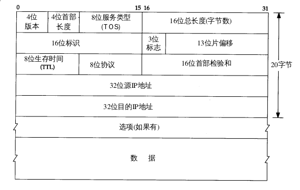

    - 总长度单位是byte，是整个IP数据报的长度。通过总长度和首部长度就可以知道IP数据报
    中内容的起始位置和长度。因为该字段长16bit，故IP数据报最长可以达到65535字节。
    - TTL是该数据报可以经过的最多路由器数。每经过一个路由器，该值减1。到0时，数据报
    就被丢弃，丢弃时，会发送ICMP报文通知源主机。

- IP路由选择

    - 路由表中的每一项都包含这些信息

        - 目的IP地址：可以是一个完整的主机地址，也可以是一个网络地址。主机地址有一个非0
        的主机号，则表示某一特定的主机，为0则表示该网络中的所有主机。
        - 下一跳地址：下一跳地址不是最终目的地，但是可以通过它到达最终目的地
        - 标志：其中有个标志可以指明目的IP地址是网络地址还是主机地址，另一个标志
        指明下一跳路由器是否为真正的路由器，异或是一个直接相连的接口
        - 为数据报的传输指定一个网络接口

    - IP路由的选择是逐跳进行的。IP路由主要完成以下功能：

        - 搜索路由表，寻找能与目的IP地址完全匹配的item
        - 搜索路由表，寻找能与目的网络号匹配的item
        - 搜索路由表，寻找默认item
        - 如果上述步骤都失败，那么该数据报就不能被传送

    - 为一个网络指定一个路由，而不是主机。可以大幅度缩小路由表的大小
    - 子网掩码 `192.168.1.1/24` 24表示有效bit数，是网络号。后面是主机号。

- ARP & RARP: ARP根据IP换MAC地址，RARP根据MAC地址换IP地址

- UDP

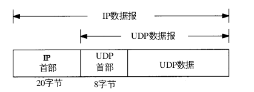
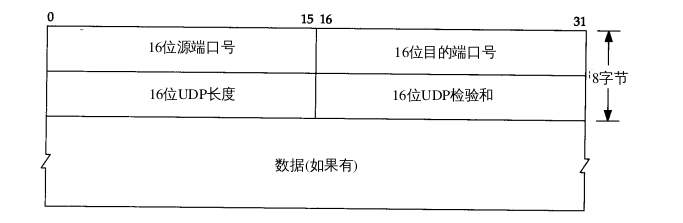

- TCP

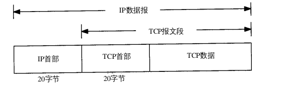
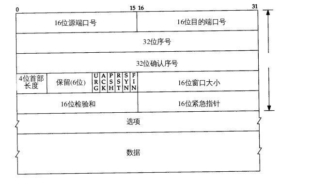

    - TCP提供全双工
    - 当建立一个新的连接时，SYN标志变为1.序号由主机选择一个ISN（Initial Sequence Number），该主机要发送的数据的第一个字节序号为ISN+1。因为SYN那个包消耗了一个序号。
    - TCP首部有6个标志位

        - URG 紧急指针，接受到这个包的程序会收到一个SIGURG
        - ACK 确认序号有效
        - PSH 接受方应尽快将这个报文交给应用层
        - SYN 同步序号发起一个连接
        - FIN 发送端完成发送任务

    - TCP流量控制由每一端通过声明的窗口大小来提供。窗口大小为字节数。
    - 常见的可选字段是MSS：Maximum Segment Size，指明本段能接收的最大长度的报文段。
    - TCP将用户数据打包成报文段，它发送数据后启动一个定时器，另一端对收到的数据进行
    确认，对失序的数据重新排序，丢弃重复数据，TCP提供端到端的流量控制，并计算和验证
    一个强制性的端到端校验和
    - 最大报文段长度（MSS）表示TCP传往另一端的最大块数据的长度。当一个连接建立时，
    连接的双方都要通告自己的MSS。MSS可以作为协商选项，但并不总是有效。一般来说，
    如果没有分段发生，MSS越大越好，因为这样传输的数据就越多，TCP和IP首部就有更高的
    网络利用率。

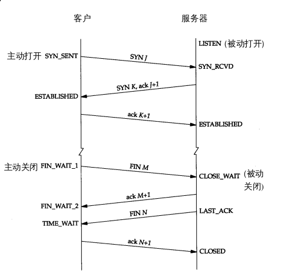

    - `TIME_WAIT`状态也称为2MSL等待状态。每个具体TCP实现必需选择一个报文段最大生存
    时间MSL（Maximum Segment Lifetime）。它是任何报文段被丢弃前在网络内的最长时间。
    通常实现中常用值为30s，1m，或者2m。

    - 当TCP执行主动关闭，并发回最后一个ACK，该连接必需在 `TIME_WAIT` 状态停留2MSL时间。
    这样可以让TCP再次发送最后的ACK以防止这个ACK丢失（另一端超时并重发最后的FIN）。
    2MSL等待的另一个结果是这个TCP连接在2MSL时间内，该套接字对不能再被使用，只有在2MSL
    时间结束之后才可以使用。
    当处于2MSL状态时，任何迟到的报文段都会被丢弃。主动关闭的一端，在2MSL期间通常不允许
    再次建立套接字，不过对于服务器可以设置 `SO_REUSEADDR`，能不能成取决于实现。

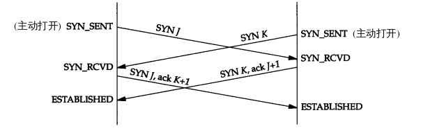
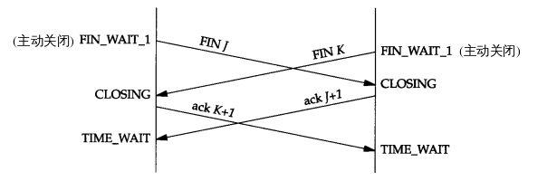

- 滑动窗口

    - 窗口左边向右边靠近为窗口合拢，这种现象发生在数据被发送和确认时。
    - 窗口右边向右边移动时为窗口张开，这种现象发生在另一端的接收进程已经读取和确认
    数据时
    - 当窗口右边向左边移动时为窗口收缩

    - 若左边沿到达右边，则为零窗口，此时发送方不能够发送任何数据。

- 慢启动。慢启动为发送方的TCP增加了一个新的窗口：拥塞窗口（congestion window），记为
cwnd。当与另一个网络的主机建立TCP连接时，拥塞窗口被初始化为1个报文段。每收到一个ACK，
拥塞窗口就增加一个报文段。cwnd单位是字节，但是cwnd的单位是报文段大小。
发送方取拥塞窗口与通告窗口中的最小值为发送上限。拥塞窗口是发送方使用的流量控制，而通告窗口则通常是接受方使用的流量窗口。
发送方开始时发送一个报文段,然后等待 A C K。当收到该 A C K时,拥塞窗口从 1增加为2,
即可以发送两个报文段。当收到这两个报文段的 A C K时,拥塞窗口就增加为 4。这是一种指数
增加的关系。

- TCP提供可靠的传输。使用的方法之一就是确认从另一端收到的数据。但数据和确认都有可能
丢失，TCP通过在发送时设置一个定时器来解决这种问题。当定时器溢出时还没有收到确认，就重传该数据。
对于每个连接，TCP管理四个不同的定时器：

    - 重传定时器使用于当希望收到另一端的确认
    - 坚持定时器使窗口大小信息保持不端流动，即使另一端关闭了其接收窗口
    - 保活定时器可检测一个空闲连接的另一端何时崩溃或重启
    - 2MSL定时器测量一个连接处于 `TIME_WAIT` 状态的时间

- 拥塞避免算法和慢启动算法对于每个连接维持两个变量：一个拥塞窗口（cwnd）和一个慢启动门限（ssthresh）

    - 对于一个给定的连接，初始化cwnd为1一个报文段，ssthresh为65535个字节
    - TCP输出不能超过cwnd和接受方通告窗口的大小
    - 当拥塞发生时（超时或者收到重复确认），ssthresh被设置为当前窗口大小的一半（cwnd和接受方通告窗口大小的最小值，但最少为2个报文段）。此外如果是超时引起了堵塞，
    则cwnd被设置为1个报文段。 -> 慢启动
    - 当新的数据被对方确认时，就增加cwnd，但增加的方法依赖于我们是否正在进行慢启动或者
    拥塞避免。如果cwnd小于等于sshthresh，则正在进行慢启动，否则正在进行拥塞避免。
    慢启动一直持续到我们回到拥塞发生时所处位置，然后转为拥塞避免。拥塞避免增加cwnd时，
    不是像慢启动一样进行指数型增长，而是每次增加1/cwnd，是一种线性增长。

- 快重传和快恢复

由于我们不知道一个重复的ACK是由一个丢失的报文段引起的,还是由于仅仅出现了几
个报文段的重新排序,因此我们等待少量重复的ACK到来。假如这只是一些报文段的重新排
序,则在重新排序的报文段被处理并产生一个新的ACK之前,只可能产生1 ~ 2个重复的ACK。
如果一连串收到 3个或3个以上的重复ACK,就非常可能是一个报文段丢失了于是我们就重
传丢失的数据报文段,而无需等待超时定时器溢出。这就是快速重传算法。
接下来执行的不是慢启动算法而是拥塞避免算法。这就是快速恢复算法。

这种情况下不是使用慢启动而是使用快恢复是因为，接受方只有收到一个包时才会产生
重复的ACK，我们收到了重复的ACK，说明1.有一个分组丢失了，2.接受方收到了另一个分组
也就是说，在收发两端仍然有流动的数据，而我们不想执行慢启动来突然减少数据流。

这个算法通常按照如下过程进行实现：

    - 当收到三个重复的ACk时，将ssthresh设置为当前拥塞窗口cwnd的一半。重传丢失的
    报文。然后设置cwnd为ssthresh+3倍的报文段大小，因为收到了三个ACK说明有三个报文
    发出去了。
    - 每次收到另一个重复的ACK时，cwnd增加一个报文段大小并且发送一个分组，因为收到了一个ACK说明
    有一个新的报文段对方收到了
    - 当下一个确认新数据的ACK到达时，设置cwnd为ssthresh。这个值是第一步中产生的。这一步采用的是拥塞避免，而不是慢启动。

- TCP通过让接受方指明希望从发送方接收的数据字节数（即窗口大小）来进行流量控制。如果窗口大小
为0，则会阻止发送方发送数据，直到窗口变成非0为止。

- 坚持定时器

    - 糊涂窗口综合征

    - 当TCP收到一个窗口大小为0的报文段。TCP发送方就停止传输报文段，直到接收方发送一个非0的窗口大小。但是如果
    这个包丢失了，就行成了死锁。所以当TCP收到一个窗口大小为0的确认时，就要启动坚持定时器，当坚持定时器到期时，
    发送一个特殊的探测报文，这个探测报文段只有一个数据，有序号，但是序号不需要被确认。探测报文的作用是提醒
    对方确认已经丢失了，需要重传。坚持定时器启动之后会一直发送直到窗口大小变为非0之后。

- 保活定时器

当TCP进入连续长时间的空闲。若服务器超过了设定时间还是没有收到客户的消息，就会发送探测报文，若多次尝试之后还是没有收到
响应，就会关闭连接。
